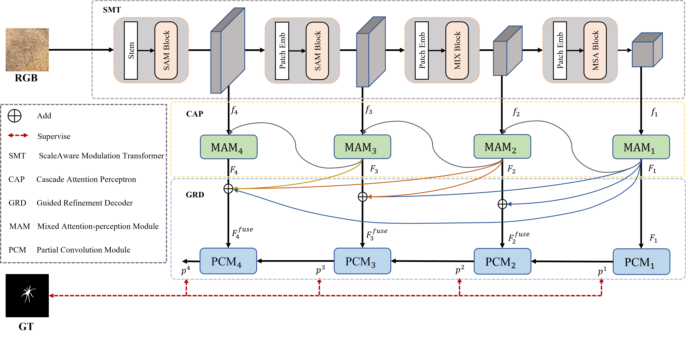
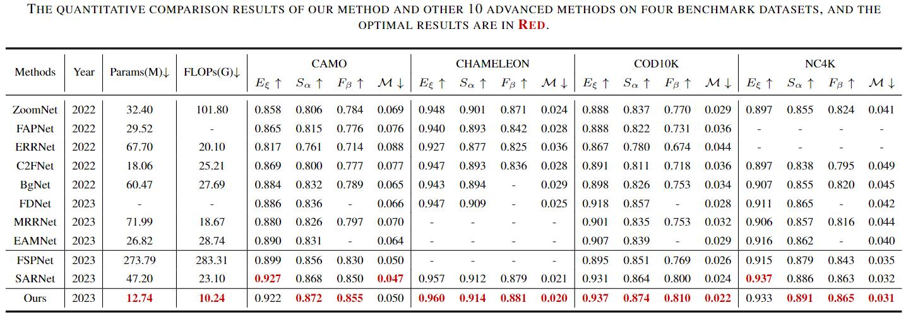
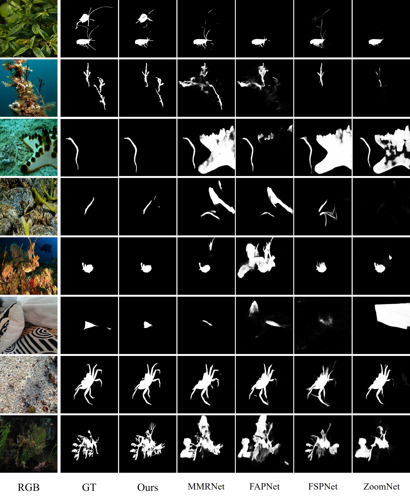

# PRNet
The paper was published by the IEEE Transactions on Circuits and Systems for Video Technology on January 2, 2024. The paper link is: - [Link](https://ieeexplore.ieee.org/document/10379651)
# **Efficient Camouflaged Object Detection Network Based on Global Localization Perception and Local Guidance Refinement**

## PRNet
Camouflaged Object Detection (COD) is a challenging visual task due to its complex contour, diverse scales, and high similarity to the background. Existing COD methods encounter two predicaments: One is that they are prone to falling into local perception, resulting in inaccurate object localization; Another issue is the difficulty in achieving precise object segmentation due to a lack of detailed information. In addition, most COD methods typically require larger parameter amount and higher computational complexity in pursuit of better performance. To this end, we proposed an global localization perception and local guidance refinement network (PRNet), that simultaneously addresses performance and computational costs. Through aggregation and effective use of semantic and details information, PRNet achieves accurate localization and refined segmentation of camouflaged objects. Specifically, with the help of a designed Cascaded Attention Perceptron (CAP), we can effectively integrate and perceive multi-scale information to localize camouflaged objects. A Guided Refinement Decoder (GRD) is designed in a top-down manner helps to extract context information and aggregate details to refine camouflaged prediction results. Extensive experimental results demonstrate that our PRNet outperforms 10 state-of-the-art models on four challenging datasets across four evaluation metrics. Notably, PRNet exhibits a more compact structure, lower parameters, and reduced computational complexity. Source codes will be available at https://github.com/hu-xh/PRNet.

## Network Architecture


## Quantitative Evaluation Results and  Qualitative Evaluation Results:



### Prerequisites
- Python 3.6
- Pytorch 1.10.2
- Torchvision 0.11.3
- Numpy 1.19.2

### Pretrained Model
Download the following `pth` and put it into main folder
- [SMT-t](https://pan.baidu.com/s/10c9efvi9eXl-7YLsoPvYTQ) with the fetch code:1234.

### Datasets
- [Datasets](https://pan.baidu.com/s/1V9VEMN5RChGvl42nU6FhSA) with the fetch code:1234.

### Results
You can download the tested results map at - [Baidu Pan link](https://pan.baidu.com/s/1TpYsv101RmmTVBARTFEugw) with the fetch code:1234.

You can download the results pth - [Baidu Pan link](https://pan.baidu.com/s/1baBE1ezwIwTzrH4KSitV3w) with the fetch code:1234.

### Evaluation
Thanks to the project of (https://github.com/jiwei0921/Saliency-Evaluation-Toolbox)

### Contact
Feel free to send e-mails to me (1558239392@qq.com).

### Citation
```
@ARTICLE{10379651,
  author={Hu, Xihang and Zhang, Xiaoli and Wang, Fasheng and Sun, Jing and Sun, Fuming},
  journal={IEEE Transactions on Circuits and Systems for Video Technology}, 
  title={Efficient Camouflaged Object Detection Network Based on Global Localization Perception and Local Guidance Refinement}, 
  year={2024},
  volume={34},
  number={7},
  pages={5452-5465},
  keywords={Transformers;Feature extraction;Task analysis;Object detection;Location awareness;Computational modeling;Sun;Camouflaged object detection;segmentation;attention perceptron},
  doi={10.1109/TCSVT.2023.3349209}}

```
